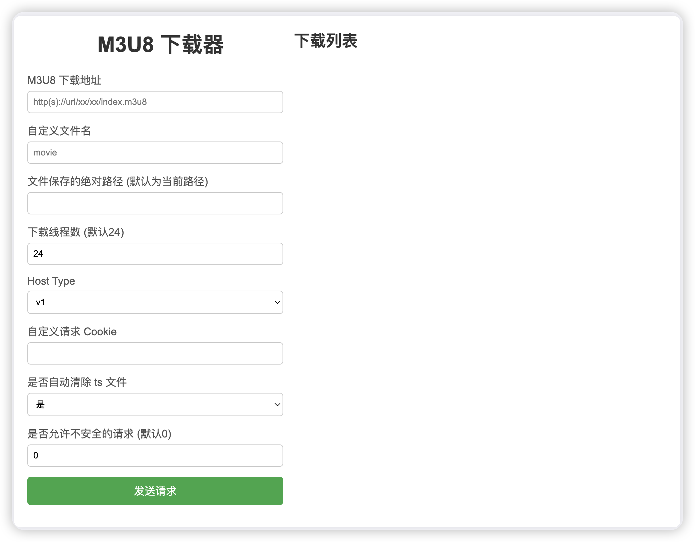

# m3u8下载器GUI版本

fork自开源项目 [m3u8-downloader](https://github.com/llychao/m3u8-downloader)，为了方便放到服务器上跑，做了一个http服务及页面



## 功能介绍

1. 支持下载多层m3u8地址（目前只测试了二层只有一个链接的）
2. 支持GUI，有个简单的页面，方便直接添加任务
3. 支持自定义端口，默认启动在10000端口上

## TODO
1. fork下猫爪的项目，改动一下，支持从猫爪一键发送到本下载工具


## 下载

已经编译好的平台有： [点击下载](https://github.com/llychao/m3u8-downloader/releases)

- windows/amd64
- linux/amd64
- darwin/amd64

## 用法

### 源码方式

```bash
自己编译：go build -o main.go
```


## 部署说明

linux下可采用systemctl方式启动，项目中提供了m3u8.service作为模板，修改为自己的参数即可

```
[Unit]
Description=My M3U8 Downloader
After=network.target

[Service]
ExecStart=you app path
Environment="GIN_MODE=release"
User=you user name
Group=you user gtoup
Restart=always
RestartSec=3
StartLimitInterval=0

[Install]
WantedBy=multi-user.target
```

启动命令

```
 systemctl enable m3u8.service
 systemctl start m3u8.service // 启动服务
 systemctl status m3u8.service // 查看状态
```